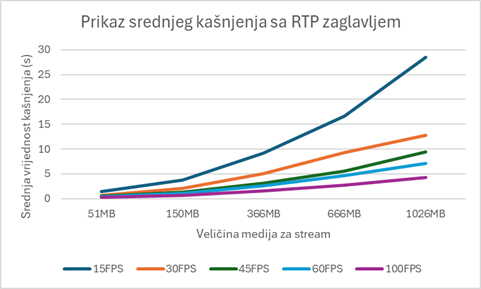
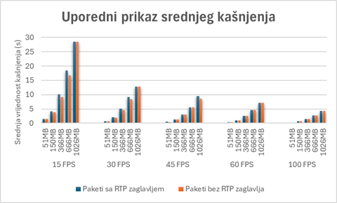

# Dizajn i implementacija WebRTC modela u NS-3 simulatoru

## Opis rješenja
U okviru ovog projekta razvijen je WebRTC (Web Real-Time Communication) model u NS-3 mrežnom simulatoru, pri čemu su implementirane ključne funkcionalnosti poput uspostavljanja peer-to-peer konekcije i prenosa podataka koristeći RTP preko UDP-a.

Implementirani model sastoji se od dva čvora – klijenta i servera, povezanih putem peer-to-peer veze. Komunikacija se inicijalno uspostavlja TCP three-way handshakeom, nakon čega slijedi prenos RTP paketa korištenjem UDP protokola. Ova implementacija omogućava simulaciju i analizu ključnih parametara komunikacije, poput gubitka paketa i kašnjenja, uz prikaz rezultata kroz dijagrame i histograme.

Simulacija pruža uvid u performanse WebRTC tehnologije u različitim mrežnim uslovima, identifikuje potencijalne izazove i doprinosi optimizaciji njenih performansi. Zaključeno je da NS-3 predstavlja efikasno okruženje za testiranje i dalji razvoj WebRTC tehnologije u realnim aplikacijama. Na sljedećoj slici je dat prikaz rada same simulacije:

 
Slika 1: Način odvijanja komunikacije 

## Opis RTP zaglavlja
U simulaciji, podaci se prenose putem RTP (Real-time Transport Protocol) zaglavlja, koje omogućava sinhronizaciju, identifikaciju i sekvenciranje medijskih paketa, čime se osigurava ispravno dekodiranje i rekonstrukcija audio i video sadržaja. RTP zaglavlje sadrži ključna polja poput verzije (V), padding bita (P), oznake za proširenje (X), broja CSRC identifikatora (CC), oznake važnih događaja (M) i tipa korisnog tereta (PT) koji definiše format podataka. Također, uključuje redni broj za praćenje ispravnog redoslijeda paketa, timestamp za sinhronizaciju i mjerenje kašnjenja, te SSRC identifikator za prepoznavanje izvora podataka. Ova struktura omogućava pouzdanu i efikasnu P2P komunikaciju u realnom vremenu. Na slijedećoj slici je prikazan izgled RTP header - a:

 
Slika 2: RTP header

## Opis testiranih scenarija i rezultati simulacija
Za potrebe simulacije kreiran je payload paket veličine 1200 bajta, što predstavlja optimalnu ravnotežu između efikasnosti pakovanja i performansi H.264 (AVC) kodeka. Ova veličina omogućava bolje upravljanje protokom podataka i smanjuje latenciju, dok se sigurno uklapa unutar Ethernet MTU od 1500 bajta, izbjegavajući fragmentaciju čak i uz dodatna RTP/UDP/IP zaglavlja. Prag kašnjenja postavljen je ispod 150 ms, u skladu s ITU-T Rec. G.114 preporukama, koje ukazuju da većina aplikacija funkcioniše stabilno ispod ovog praga. Rezultati simulacije pokazuju da latencija ostaje stabilna do 180 korisnika, s prosječnom vrijednošću od 145,20 ms i standardnom devijacijom od 20,48 ms. Iznad tog broja korisnika dolazi do naglog porasta latencije, što ukazuje na dostizanje gornje granice performansi sistema.

## Prikaz srednjeg kašnjena sa RTP zaglavljem
Na slici 3. vidi se prikaz srednjeg kašnjenja sa RTP zaglavljem. Grafik sadrži pet krivulja, od
kojih svaka predstavlja razlicitu vrijednost FPS-a: 15, 30, 45, 60 i 100 FPS.

 
Slika 3 :Prikaz srednjeg kašnjena sa RTP zaglavljem

## Prikaz srednjeg kašnjenja bez RTP zaglavlja
Analiza koristi iste parametre kao prethodno, prikazujući srednje kašnjenje u zavisnosti od veličine paketa (51MB, 150MB, 366MB, 666MB, 1026MB) i različitih FPS vrijednosti (15, 30, 45, 60, 100 FPS). Grafik pokazuje da povećanje veličine paketa povećava kašnjenje, dok veći FPS smanjuje kašnjenje. U ovom slučaju, paketi su slani bez RTP zaglavlja, što je rezultiralo smanjenjem srednjeg kašnjenja proporcionalno veličini RTP zaglavlja.

 
Slika 4 :Prikaz srednjeg kašnjena bez RTP zaglavlja

## Uporedni prikaz srednjeg kašnjenja
Grafik prikazuje uporednu analizu srednjeg kašnjenja s i bez RTP zaglavlja. Uočava se minimalna razlika u kašnjenju zbog malog utjecaja RTP zaglavlja od 12B. Ova razlika je primjetnija pri nižim FPS vrijednostima, dok pri većim FPS-ima (60FPS i 100FPS) gotovo nestaje. To pokazuje da s porastom FPS-a kašnjenje uzrokovano RTP zaglavljem postaje zanemarivo, dok veličina paketa i brzina prijenosa ostaju ključni faktori koji utiču na ukupno kašnjenje.

 
Slika 5 :Uporedni prikaz srednjeg kašnjenja

## Zaključak

Praktična implementacija WebRTC modela u NS-3 simulatoru fokusirao se na primjenu teorijskih znanja o WebRTC-u kroz simulaciju i analizu rezultata specifičnih scenarija. Testiran je utjecaj različitih FPS vrijednosti (od 15 do 100 FPS-a) na kašnjenje u mreži, uz promjenu intervala generisanja paketa. Rezultati simulacija pokazali su da veličina paketa, FPS vrijednosti i prisustvo RTP zaglavlja značajno utječu na kašnjenje.

Optimalna veličina paketa od 1200 bajta pokazala se najboljom, jer omogućava efikasniji prenos podataka i smanjuje rizik od fragmentacije u odnosu na Ethernet MTU od 1500 bajta. Povećanje veličine paketa povećava kašnjenje, ali brzina tog povećanja zavisi od FPS vrijednosti. Pri nižim FPS vrijednostima, kašnjenje se povećava brže s rastom veličine paketa, dok veće FPS vrijednosti smanjuju taj rast. Također, prisustvo RTP zaglavlja dodatno povećava kašnjenje, dok njegovo izostavljanje smanjuje isto, što je potvrđeno kroz simulacije s i bez RTP zaglavlja.

Zbog jednostavne implementirane topologije, prostor za varijaciju parametara bio je ograničen, što je otežalo planiranje testnih scenarija. Ovaj limitirani prostor nije omogućio dovoljno fleksibilnosti u ispitivanju svih kombinacija parametara, što je dovelo do izazova u kreiranju i optimizaciji testnih scenarija. Kao rezultat, neki aspekti testiranja su morali biti pojednostavljeni, a preciznost rezultata smanjena jer nisu mogli biti u potpunosti istraženi svi potencijalni utjecaji varijacija parametara na performanse sistema.
